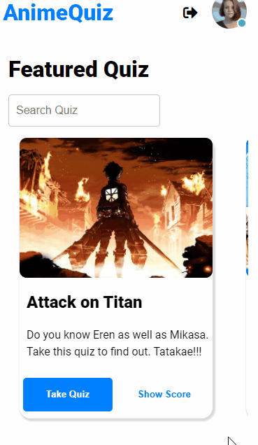

# quiz-screens

These are the screens for my quiz appp

### animequiz app is platform where people can test their knowdelge on their favourite anime.

# Pages

- [Landing Page](https://anime-quiz-screens.netlify.app/)
- [Question Page](hhttps://anime-quiz-screens.netlify.app/pages/question/question.html)
- [Result Page](https://anime-quiz-screens.netlify.app/pages/result/result.html)
- [Login](https://ecommerece-shoe-screen.netlify.app/pages/login/login.html)
- [Rules Page](https://anime-quiz-screens.netlify.app/pages/rules/rules.html)

## Clone the repository

- Using git bash : `git clone https://github.com/Kevin-Solomon/quiz-screens.git`

# Issue Reporting

Encountered a bug or do you need a need a feature request ? Please to do check the issues tab on the repo if your issue / request does not exist , [open a new issue](https://github.com/Kevin-Solomon/eCommerce-screens/issues/new)

**_If you have encountered a bug a before and after picture of the bug would be very helpful or if time permits a small video of the bug would greatly help us undertand the issue._**

# 👨‍💻 Connect with me

## Clone the repository

- Using git bash : `git clone https://github.com/Kevin-Solomon/eCommerce-screens.git`

# Issue Reporting

Encountered a bug or do you need a need a feature request ? Please to do check the issues tab on the repo if your issue / request does not exist , [open a new issue](https://github.com/Kevin-Solomon/eCommerce-screens/issues/new)

**_If you have encountered a bug a before and after picture of the bug would be very helpful or if time permits a small video of the bug would greatly help us undertand the issue._**

# 👨‍💻 Connect with me

# Desktop Version

# Mobile Version

